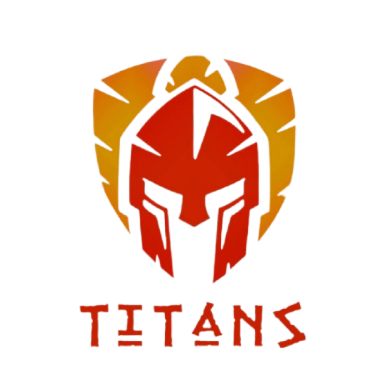
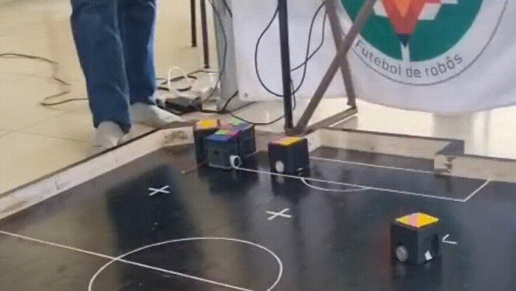

<div align="center">
  

  # 🤖 VSSS - Robô de Futebol Autônomo
  **Equipe TITANS de Robótica | FCTE - Universidade de Brasília (UnB)**

  
  
  
  
</div>

---

## ⚽ Sobre o Projeto
Este repositório contém o código-fonte, esquemas eletrônicos e documentação mecânica dos robôs da categoria **VSSS (Very Small Size Soccer)** da equipe TITANS. 

A categoria VSSS consiste em partidas de futebol de robôs autônomos de 3 contra 3. Cada robô deve caber em um cubo de 7.5 x 7.5 x 7.5 cm e não possui controle humano durante o jogo. Toda a estratégia, controle PID, visão computacional e comunicação sem fio operam em conjunto para que o time marque gols e defenda sua área.

<div align="center">
  
</div>

---

## 🗺️ Arquitetura do Repositório
Para facilitar o desenvolvimento multidisciplinar, nosso projeto está dividido nas seguintes áreas:

* 📂 **`/Controle`**: Código principal, onde está o comportamento do robô e a visão computacional.  
* 📂 **`/Estrutura`**: Informações sobre a estrutura e peças prontas para impressão 3D. 
* 📂 **`/Firmware`**: Todo o código embarcado (ESP-32).
* 📂 **`/Docs`**: Documentos e arquivos diversos.

---

## 🛠️ Tecnologias Utilizadas
* **Software/Estratégia:** C++, Python.
* **Controle e Otimização:** Algoritmos de controle (PID) e Behavior Trees.
* **Hardware:** Microcontrolador ESP32 e motores DC com encoder.
* **Mecânica:** Autodesk Fusion (Modelagem 3D) e Impressão 3D.

---

## 🚀 Como Começar (Setup Local)

### Pré-requisitos
Antes de começar, você precisará ter instalado em sua máquina:
* [Git](https://git-scm.com/)
* [Python 3.x](https://www.python.org/)
* [VSS-Vision](https://github.com/robocin/vss-vision)

### Instalação
1. Clone este repositório:
   ```bash
   git clone https://github.com/team-titans-unb/Projeto_V3S.git
   ```
2. Acesse a pasta do projeto:
   ```bash
   cd Projeto_V3S
   ```
3. Instale as dependências necessárias:
   ```bash
   pip install -r requirements.txt
   ```
4. Ready to go!

---

## 📞 Equipe e Contatos
Desenvolvido com 💙 pela **Equipe TITANS**.

* **Instagram:** [@robotictitans](https://www.instagram.com/robotictitans/)
* **Email:** [vssstitans@gmail.com]
* **Local:** FCTE - Universidade de Brasília (UnB), Campus Gama.

---
*Licença MIT - Sinta-se livre para usar, estudar e modificar este projeto.*
