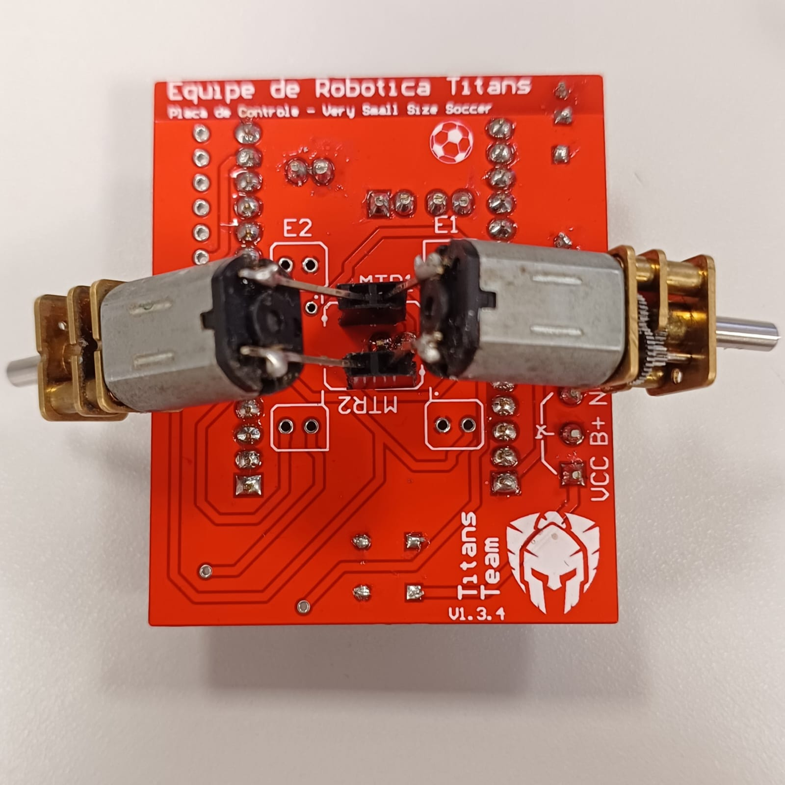

# Envio de PWM para os motores via WI-FI

## Prefácio
Uma das etapas durante a validação da construção final de uma PCB é o envio de PWM para os motores via Wi-Fi. 
Isso é necessário para verificar se o PWM enviado está sendo convertido em corrente corretamente.

## Passo a passo
Separe a PCB montada, uma ESP-32, uma bateria carregada (com cabo para conectar na PCB), um cabo Micro USB e um computador. O computador do LAB será usado para explicar o processo.

---
### Configurando a ESP-32
A ESP-32 deve estar com o código padrão utilizado no VSSS, para receber os pacotes de dados enviados pelo computador.
O código está guardado no [GitHub do VSSS](https://github.com/team-titans-unb/Projeto_V3S), no endereço: `/Firmware/ESP-32/main`.

#### Gravando o código na placa:
A forma padrão para gravar o código na ESP-32 é:

1. Clone o [repositório](https://github.com/team-titans-unb/p_vsss). *Já clonado no endereço `~/Documentos/VSSS/`, no computador do LAB.*
2. Abra o [Arduino-IDE](https://www.arduino.cc/).
3. Vá em `File -> Open...`, navegue até o diretório do repositório, entre em: `/Firmaware/ESP-32/main` e abra o arquivo `main.ino`.
4. Depois de carregar o projeto, selecione a ESP-32 seguindo os passos: `Tools -> Board -> esp32 -> ESP32 Dev Module`. Necessário possuir a placa `esp32 by Espressif` instalada em `Boards Manager`.
5. Antes de fazer o `Upload`, você pode checar no arquivo `config.h`, dentro do projeto em aberto, a conexão Wi-Fi, para verificar em qual rede ele se conectará e qual senha ele utilizará. *Na ausência de uma rede, você pode alterar as configurações para fazer com que ele se conecte no seu telefone.*
6. Por fim, faça o `Upload` do código para a ESP-32, clicando na setinha preta envolta por um círculo azul.

#### Possíveis problemas

* **Bibliotecas**: Certifique-se de possuir a biblioteca `esp32 bt Espressif` instalada e na versão mais recente.
* **ESP-32 Estragada**: Nem toda ESP-32 estragada parece estar estragada; caso perceba muitos problemas ao fazer o `Upload`, verifique se o problema persiste mesmo em outra ESP-32.

#### Verificando o IP do Robô
Para enviar os pacotes via Wi-Fi, precisamos estar na mesma rede da ESP-32 e a identificar.

Para o Wi-Fi, você tem duas opções: ou utilizar um Wi-Fi normal, ou criar uma rede com o seu celular. Encontrar o endereço de IP dependerá do seu método de rede utilizado, caso você tenha escolhido usar um Wi-Fi normal, você precisará entrar dentro do roteador pelo navegador. É recomendado utilizar o Wi-Fi "LARSIS_ROBOS", pois ele permite esse acesso.
Para o Wi-Fi "LARSIS_ROBOS", siga os passos:

1. Conecte-se na rede.
2. Abra o navegador.
3. Escreva na barra de endereço: "192.168.0.1".

*No momento da criação desse documento, o wifi "LARSIS_ROBOS" não está disponível, o que impossibilitou a criação do restante desse passo a passo*

Caso você tenha escolhido criar uma rede com o seu celular, você precisará procurar nas configurações do seu aparelho o IP do robô.

---

### Conectando os motores
Os motores devem ser colocados de forma específica. Observe na imagem abaixo onde se encaixa cada um dos pinos dos motores.

{width="300"}

---

### Enviando Pacotes
Os pacotes serão enviados através de um script em python utilizando [Jupyter Notebook](https://jupyter.org/). 

#### Abrindo o script
A maneira recomendada de rodar o código é utilizando o Visual Studio Code. *Já instalado e configurado no computador do LAB.*

1. Abra o [Visual Studio Code](https://code.visualstudio.com/).
2. Vá em `File -> Open Folder`, navegue até o script: `~/Documentos/VSSS/p_vsss/Controle/tools` e clique em `Abrir`.
3. Dentro da pasta `tools`, abra o script `send_data.ipynb`

#### Entendendo o script
Assim que você abrir o arquivo, você verá alguns blocos de códigos. O Jupyter Notebook funciona resumidamente da seguinte maneira: ele executa o que deve ser executado e guarda as variáveis e funções do bloco em questão na memória, assim é possível reutilizar o que foi rodado em outros blocos. 

#### Rodando o script
Com a ESP-32 conectada na PCB, com a bateria ligada, a ESP-32 e o computador na mesma rede Wi-Fi, com o IP da ESP-32 em mãos e com os motores a postos, finalmente:

1. Rode o primeiro bloco de código, que possui a função `send_speed`. *Assim, o script guardará na memória essa função e você poderá chamá-la a seguir.*
2. Desça um pouco o script, altere a variável `IP_ROBO` para o IP anotado.
3. Envie uma velocidade rodando algum bloco `send_speed(a,b,c,d)`, onde `a` e `b` são PWM e `c` e `d` são direções.

## Conclusão
Afinal, para que serve esse rápido processo? Bem... Enviando PWM para nossos motores, podemos observar o resultado final do que foi construido. É esperado que para altos PWM o torque seja alto, que não haja interrupções abruptas de passagem de corrente ao mover levemente os motores e dentre outros...

A todos, um obrigado!
